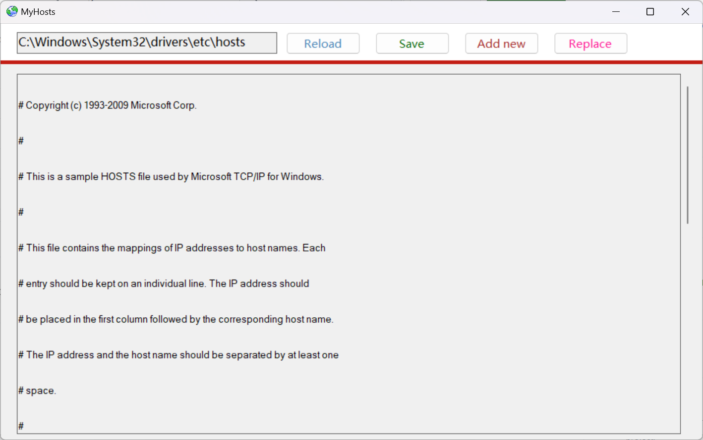

# MyHosts

**MyHosts** is a utility that helps you edit and manage the Windows hosts file for network configuration and blocking. It's a lightweight Windows Forms application for managing the local hosts file on Windows systems.

## 📋 Features

- **Easy Host Management** - Add, edit, and remove host entries with a user-friendly interface
- **Real-time Editing** - Direct editing of the hosts file with syntax validation
- **Backup & Restore** - Automatic backup creation before modifications
- **Search & Filter** - Quickly find specific host entries
- **Clean Architecture** - Built with pure .NET Framework, no third-party dependencies

## 🖥️ Screenshots



_MyHosts interface showing hosts file management functionality_

## 🔧 Requirements

- **Operating System**: Windows 7 SP1 or later
- **Framework**: .NET Framework 4.8
- **Permissions**: Administrator privileges (required for hosts file modification)
- **Build Tools**: MSBuild (included with Visual Studio or .NET Framework SDK)

## 🚀 Quick Start

### Building the Application

```bash
# Clone the repository
git clone https://github.com/ropean/MyHosts
cd MyHosts

# Build in Release mode
scripts\build.cmd

# Or build in Debug mode (edit scripts\build.cmd)
```

### Running the Application

1. Navigate to `MyHosts\bin\Release\`
2. Run `MyHosts.exe` as Administrator
3. Start managing your hosts file

## 📁 Project Structure

```
MyHosts/
├── assets/                       # Project assets
│   ├── screenshot.png            # Application screenshot
│   ├── app.ico                   # Application icon
│   └── top_backgroud.png         # Background image
├── CHANGELOG.md                  # Project changelog
├── LICENSE                       # MIT license
├── README.md                     # This file
├── MyHosts/                      # Main application
│   ├── App.config                # Application configuration
│   ├── app.manifest              # Application manifest
│   ├── Program.cs                # Application entry point
│   ├── FrmMain.cs                # Main form
│   ├── FrmEdit.cs                # Edit form
│   ├── CustomNotificationForm.cs # Notification form
│   ├── Utility.cs                # Helper utilities
│   └── Properties/               # Application properties
└── scripts/                      # Build and utility scripts
    ├── build.cmd                 # Build script (Release mode)
    ├── clean.cmd                 # Clean script (Debug & Release)
    └── Scripts.md                # Scripts documentation
```

## 🏗️ Build Scripts

The project includes convenient build scripts:

### Build Script (`scripts/build.cmd`)

- Builds the project in Release configuration only
- Optimized for production deployment
- Automatic NuGet package restore

### Clean Script (`scripts/clean.cmd`)

- Removes both Debug and Release build artifacts
- Cleans cached NuGet packages
- Prepares for clean rebuilds

## 📋 Dependencies

**None!** This project uses only the .NET Framework 4.8 and standard Windows APIs.

### Previously Removed Dependencies

- ~~RestSharp~~ (removed due to security vulnerabilities)
- ~~Fody~~ (removed to eliminate third-party dependencies)
- ~~Costura.Fody~~ (removed to eliminate third-party dependencies)

## 🛡️ Security

- **No External Dependencies** - Eliminates supply chain attack vectors
- **Administrator Required** - Appropriate permission model for system file editing
- **Backup Creation** - Automatic backup before any modifications
- **Input Validation** - Proper validation of host entries

## 🔒 Hosts File Operations

The application performs the following operations on the hosts file:

- **Location**: `%SystemRoot%\System32\drivers\etc\hosts`
- **Backup**: Creates timestamped backups before modifications
- **Validation**: Ensures proper hosts file format
- **Permissions**: Requires administrator privileges

## 🤝 Contributing

1. Fork the repository
2. Create a feature branch (`git checkout -b feature/AmazingFeature`)
3. Commit your changes (`git commit -m 'Add some AmazingFeature'`)
4. Push to the branch (`git push origin feature/AmazingFeature`)
5. Open a Pull Request

## 📝 Development Notes

- **IDE**: Developed with Visual Studio
- **Language**: C# with Windows Forms
- **Target Framework**: .NET Framework 4.8
- **Architecture**: x86/x64 compatible
- **UI**: Windows Forms with custom styling

## ⚖️ License

This project is licensed under the MIT License - see the [LICENSE](LICENSE) file for details.

## 🙋 Support

If you encounter any issues or have questions:

1. Check the [Issues](https://github.com/ropean/MyHosts/issues) page
2. Create a new issue with detailed information
3. Include your Windows version and .NET Framework version

## 📊 Version History

See [CHANGELOG.md](CHANGELOG.md) for detailed version history and changes.

### Latest Changes

- **v0.2.0** - Current release

  - Enhanced hosts file management
  - Improved user interface
  - Better backup and restore features
  - Performance optimizations

- **v1.0.0** - Initial release
  - Basic hosts file management
  - Add, edit, remove functionality
  - Backup and restore features

---

**Note**: This application modifies system files and requires administrator privileges. Always backup your hosts file before making changes.
